## Оглавление
  - [Part 1. Готовый докер](#Part-1-Готовый-докер)
  - [Part 2. Операции с контейнером](#Part-2-Операции-с-контейнером)
  - [Part 3. Мини веб-сервер](#Part-3-Мини-веб-сервер)
  - [Part 4. Свой докер](#Part-4-Свой-докер)
  - [Part 5. Dockle](#Part-5-Dockle)
  - [Part 6. Базовый Docker Compose](#Part-6-Базовый-Docker-Compose)

## <a id="Part-1-Готовый-докер">Part 1. Готовый докер</a>
  1.  Взять официальный докер образ с __nginx__ и выкачать его при помощи __docker pull__.
  Проверить наличие докер образа через __docker images__.
  Запустить докер образ через __docker run -d [image_id|repository]__(здесь используется repository).
  Проверить, что образ запустился через __docker ps__.
  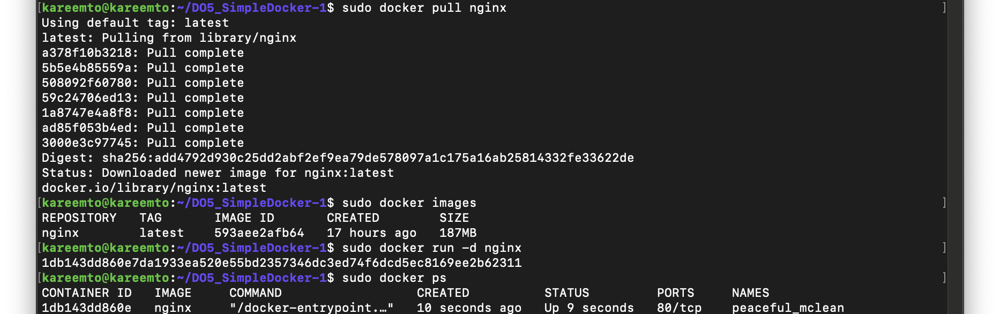
  2. Посмотреть информацию о контейнере через docker inspect [container\_id|container\_name] (здесь id)
  размер контейнера - __1095 B (размер образа 187 MB)__, список замапленных портов __нет__, ip контейнера __172.17.0.2__
  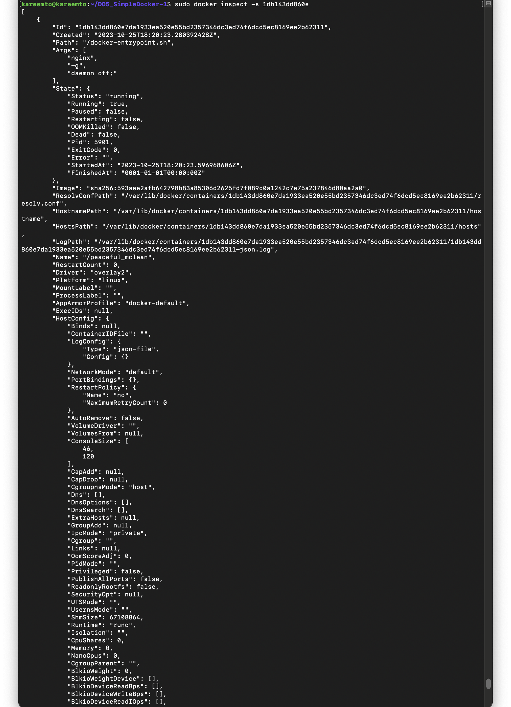
  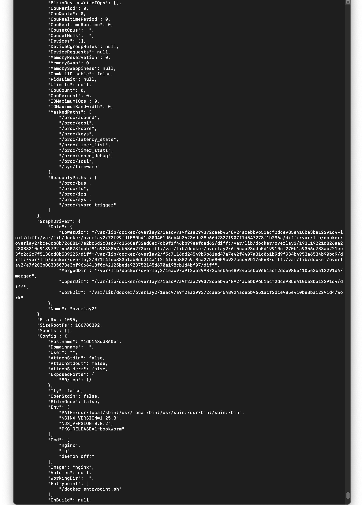
  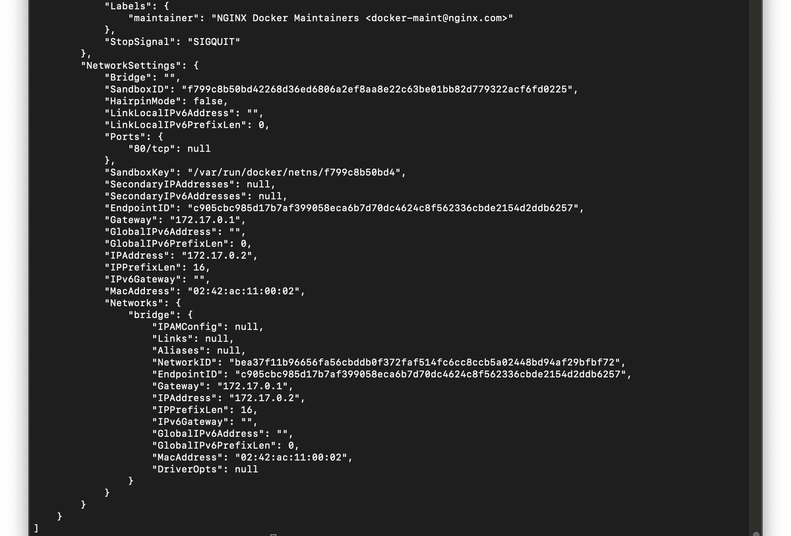
  3. Остановить докер образ через __docker stop [container\_id|container\_name]__(здесь name).
  Проверить, что образ остановился через __docker ps__. 
  Запустить докер с портами 80 и 443 в контейнере, замапленными на такие же порты на локальной машине,
  через команду __run__. Проверить, что в браузере по адресу localhost:80 доступна стартовая страница nginx.
  Перезапустить докер контейнер через __docker restart [container_id|container_name]__(здесь id). Проверить командой
  __docker ps__, что контейнер запустился.
  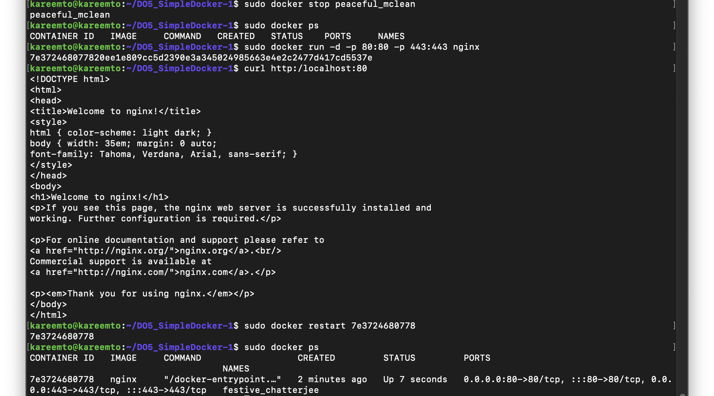

## <a id="Part-2-Операции-с-контейнером">Part 2. Операции с контейнером</a>
  1. Прочитать конфигурационный файл __nginx.conf__ внутри докер контейнера через команду __exec__
  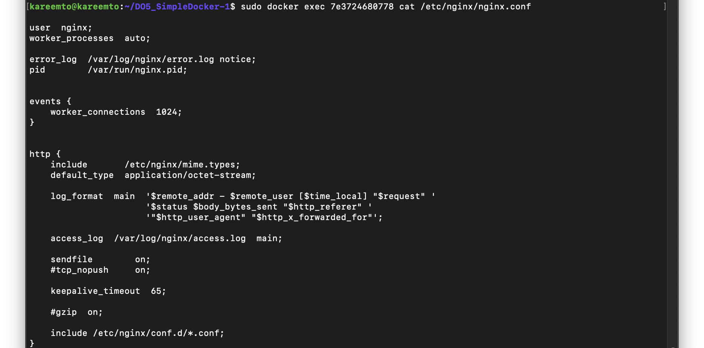
  2. Создать на локальной машине файл __nginx.conf__. 
  Настроить в нем по пути /status отдачу страницы статуса сервера nginx
  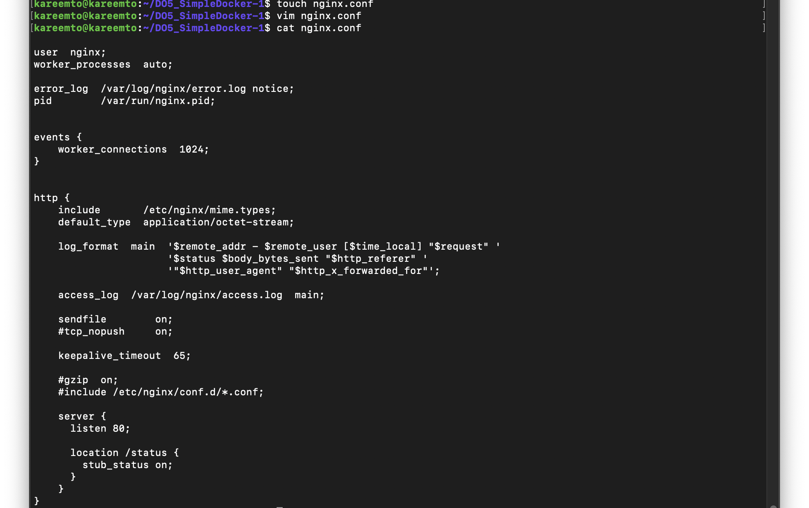
  3. Скопировать созданный файл nginx.conf внутрь докер образа через команду __docker cp__.
  Перезапустить nginx внутри докер образа через команду __exec__.
  Проверить, что по адресу __localhost:80/status__ отдается страничка со статусом сервера nginx
  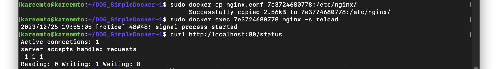
  4. Экспортировать контейнер в файл container.tar через команду __export__.
  Остановить контейнер. 
  Удалить образ через __docker rmi [image_id|repository]__(repository), не удаляя перед этим контейнеры.
  Удалить остановленный контейнер.
  Импортировать контейнер обратно через команду import.
  Запустить импортированный контейнер.
  Проверить, что по адресу localhost:80/status отдается страничка со статусом сервера nginx.
  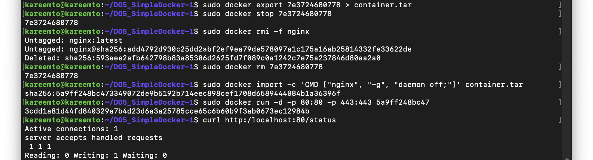

## <a id="Part-3-Мини-веб-сервер">Part 3. Мини веб-сервер</a>
  1. Написать мини сервер на C и FastCgi, который будет возвращать простейшую страничку с надписью Hello World!.
  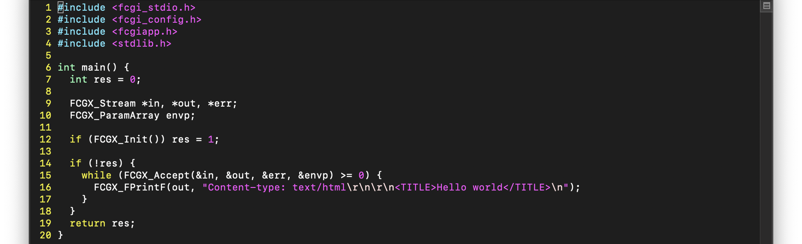
  2. Написать свой nginx.conf, который будет проксировать все запросы с 81 порта на 127.0.0.1:8080
  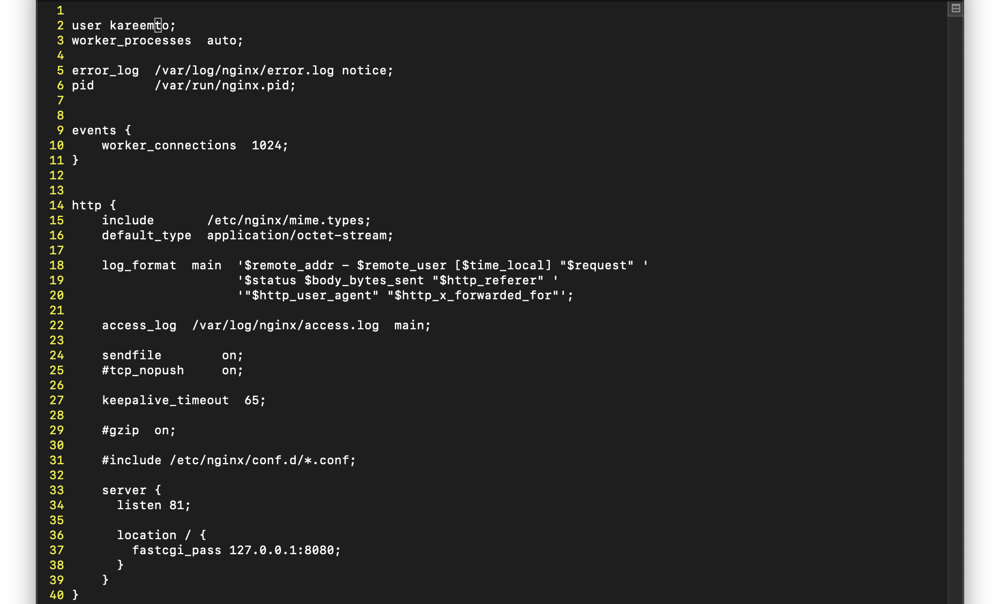
  3. Запустить написанный мини сервер через spawn-fcgi на порту 8080. Проверить, что в браузере по localhost:81
  отдается написанная вами страничка.
  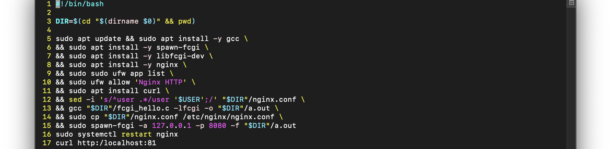

## <a id="Part-4-Свой-докер">Part 4. Свой докер</a>
  1. Написать свой докер образ, который: собирает исходники мини сервера на FastCgi из 
  [Части 3](#Part-3-Мини-веб-сервер), запускает его на 8080 порту, копирует внутрь образа написанный
  ./nginx/nginx.conf.
  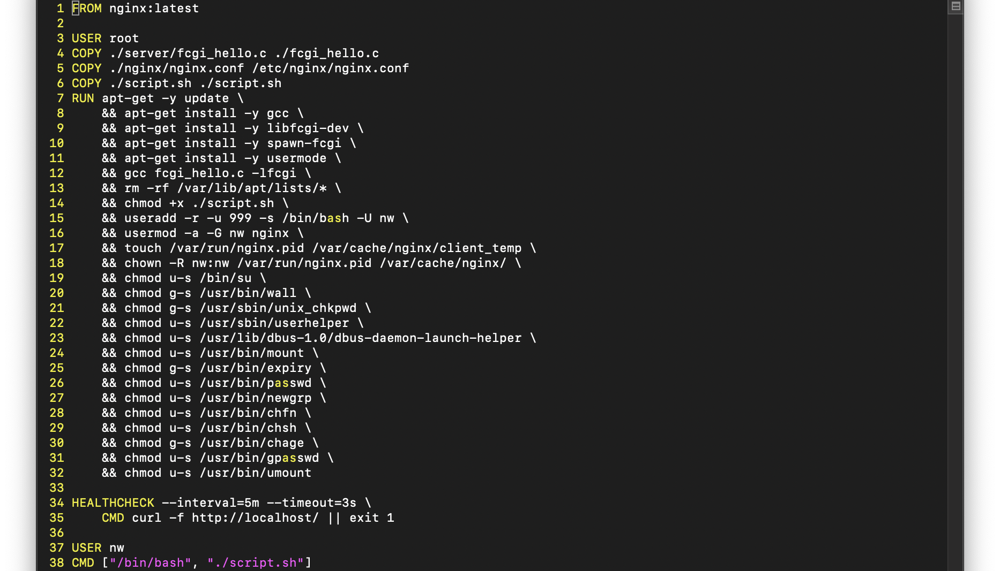
  2. запускает nginx
  
  3. Собрать написанный докер образ через __docker build__ при этом указав имя и тег.
  Проверить через __docker images__, что все собралось корректно. 
  Запустить собранный докер образ с маппингом 81 порта на 80 на локальной машине и маппингом папки ./nginx
  внутрь контейнера по адресу, где лежат конфигурационные файлы nginx'а [Часть 2](#Part-2-Операции-с-контейнером).
  Проверить, что по localhost:80 доступна страничка написанного мини сервера.
  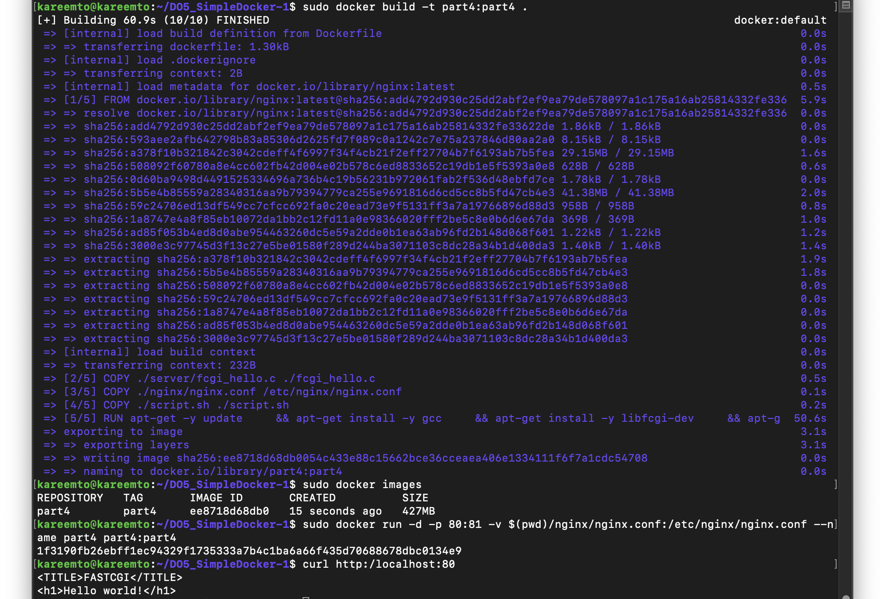
  4. Дописать в ./nginx/nginx.conf проксирование странички /status, по которой надо отдавать статус сервера nginx.
  Перезапустить докер образ.
  Проверить, что теперь по localhost:80/status отдается страничка со статусом nginx
  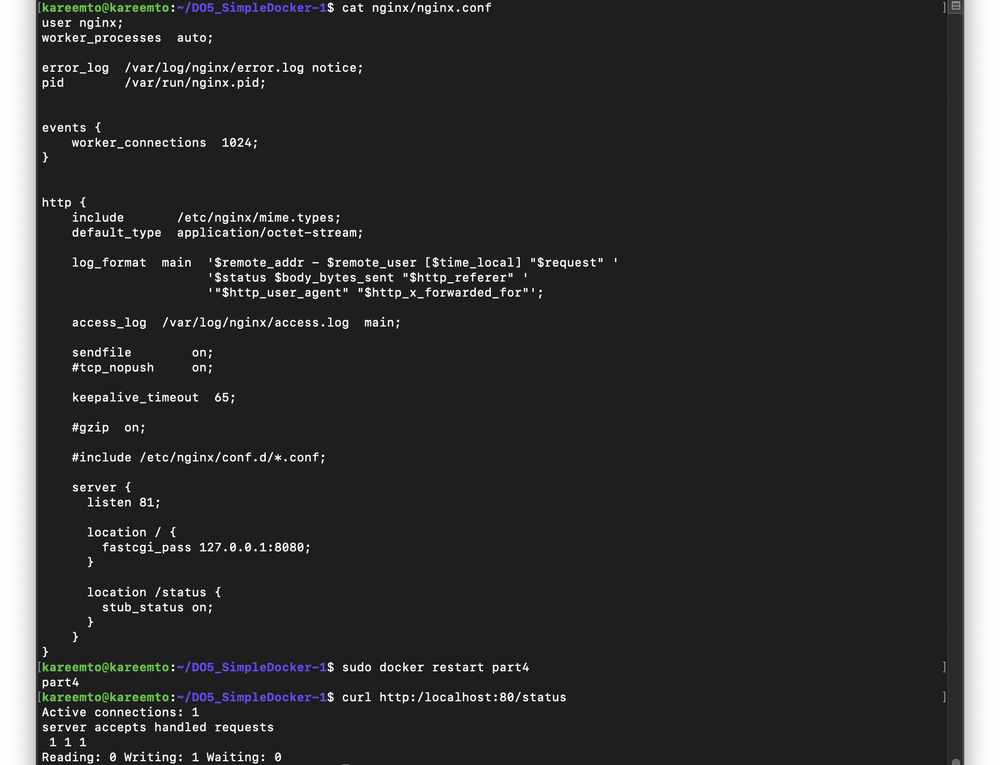

## <a id="Part-5-Dockle">Part 5. Dockle</a>
  1. Просканировать образ из предыдущего задания через __dockle [image_id|repository]__(здесь repository).
  Исправить образ так, чтобы при проверке через dockle не было ошибок и предупреждений.
  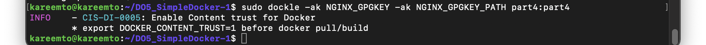

## <a id="Part-6-Базовый-Docker-Compose">Part 6. Базовый Docker Compose</a>
  1. Написать файл docker-compose.yml, с помощью которого: поднять докер контейнер из [Части 5](#Part-5-Dockle)
  (он должен работать в локальной сети, т.е. не нужно использовать инструкцию EXPOSE и мапить порты на локальную
   машину), поднять докер контейнер с nginx, который будет проксировать все запросы с 8080 порта на 81 порт
  первого контейнера, замапить 8080 порт второго контейнера на 80 порт локальной машины. Остановить все запущенные
  контейнеры. Собрать и запустить проект с помощью команд __docker-compose build__  и __docker-compose up -d__. 
  Проверить, что в браузере по localhost:80 отдается написанная вами страничка, как и ранее.
  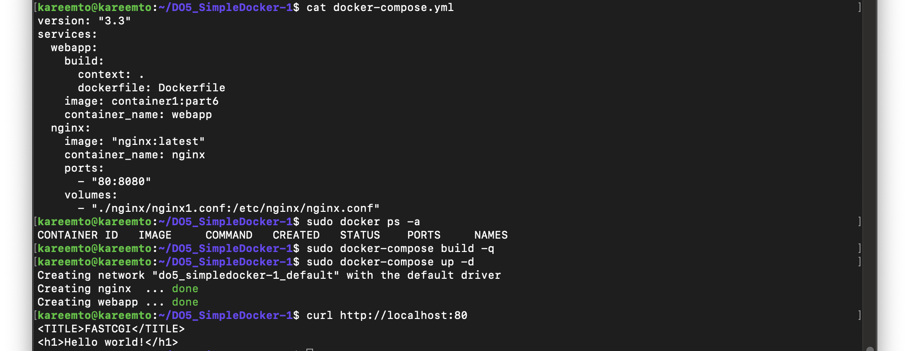

